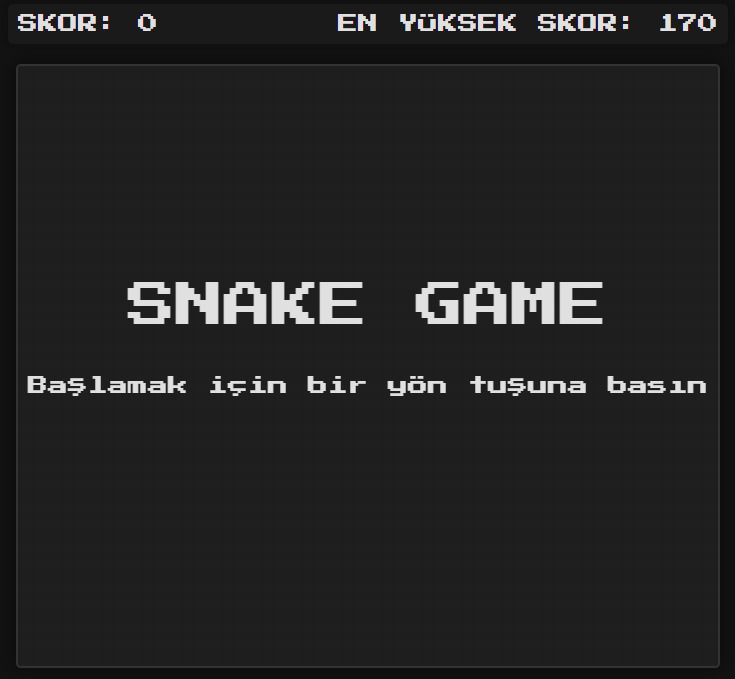
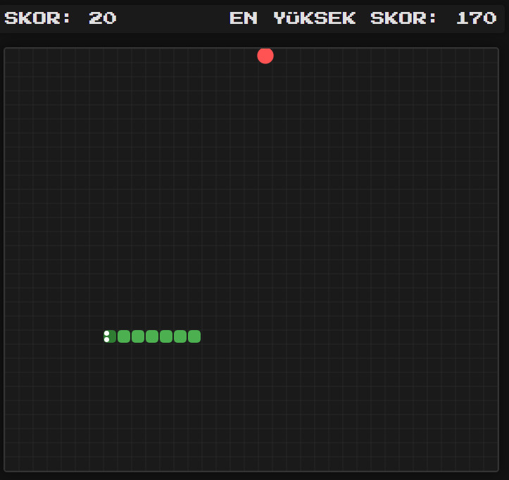
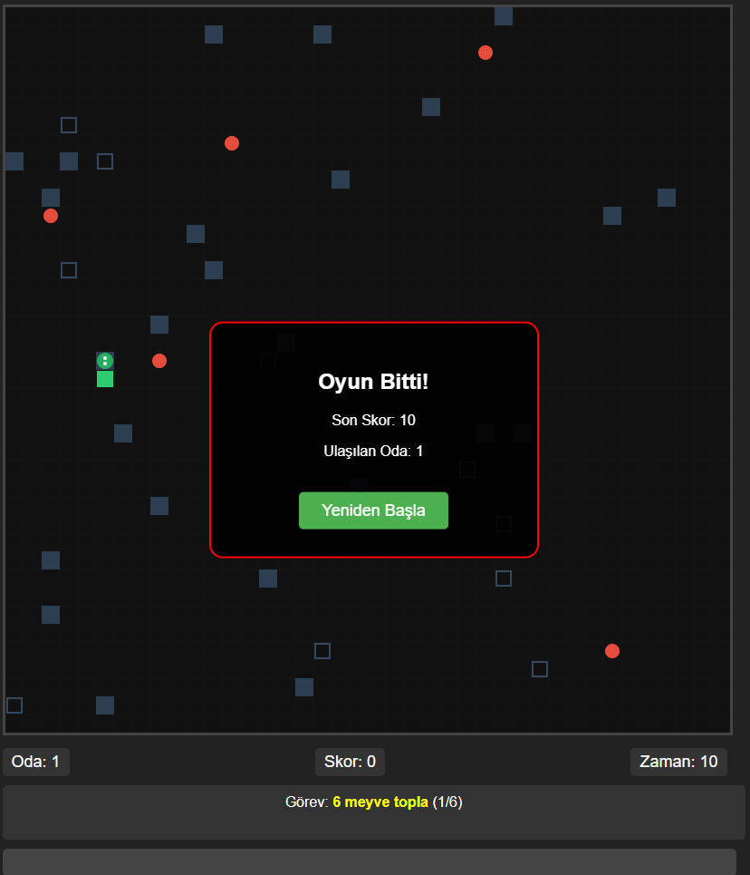

# 🐍 Snake Oyunu

HTML5 Canvas ve Vanilla JavaScript ile geliştirilmiş klasik Snake oyunu.

[](https://rezoD51.github.io/SnakeGame/)
## 🎮 Oynanış ve Kurallar
- **Amaç**: Yılanı kontrol ederek elmaları toplayıp skoru artırmak
- **Kontroller**:
  - ←↑→↓ : Yön tuşları ile hareket
  - SPACE : Oyun bitiminde yeniden başlatma
- **Kurallar**:
  - Duvarlara veya kendi kuyruğuna çarpmadan elmaları topla
  - Her elma +10 puan
  - En yüksek skor lokal depolamada saklanır

## 📸 Ekran Görüntüleri

| Başlangıç Ekranı |   

| |

| Oyun İçi |

| |

| Oyun Sonu | 

| |

## ⚙️ Teknolojiler
- HTML5 Canvas
- Vanilla JavaScript
- CSS3
- Google Fonts (Press Start 2P)

## 📁 Kod Yapısı
```javascript
class SnakeGame {
  constructor() {
    // Oyun durumu ve DOM elementleri
    this.init()       // Oyunu başlat
    this.reset()      // Oyunu sıfırla
    this.spawnApple() // Yeni elma oluştur
    this.endGame()    // Oyun sonu işlemleri
  }
  
  // Ana oyun döngüsü
  loop() {
    this.update() // Konum ve çarpışma kontrolü
    this.draw()   // Tüm görsel elementlerin çizimi
  }
}
