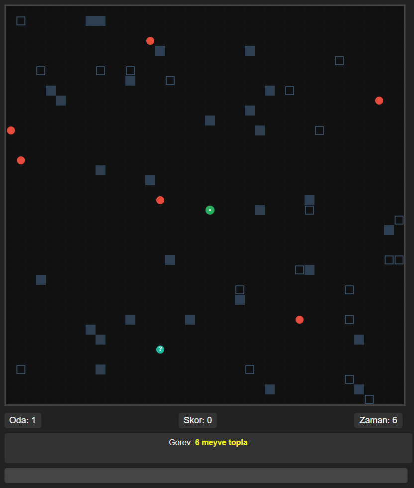

# 🐍 Snake Oyunu

HTML5 Canvas ve Vanilla JavaScript ile geliştirilmiş klasik Snake oyunu.

Oynamak İçin Tıkla

## 🎮 Oynanış ve Kurallar
- **Amaç**: Verilen görevleri yaparak odalar geçmek en en yüksek skoru elde etmek 
- **Kontroller**:
  - ←↑→↓ : Yön tuşları ile hareket
  - WASD : İle Hareket
- **Kurallar**:
  - Duvarlara veya kendi kuyruğuna çarpmadan elmaları topla
  - Tüm anahtarları toplayıp kilitlere yerleştir
  - Görevde istenen süre kadar hayatta Kal
  - Soru işaretleri rastgele ektra özellik sağlar (2x puan kazanma, 15 saniye boyunca yavaş hareket etme vs.)
## 🌟 Özellikler
- Çoklu oda sistemi
- Farklı görev modları
- Rastgele oluşturulmuş labirentler
- Güçlendirme öğeleri (power-ups)
- Duyarlı tasarım (responsive design)

## 📸 Ekran Görüntüleri

| Oyun İçi |

| |

| Oyun Sonu | 

| |

## ⚙️ Teknolojiler
- HTML5 Canvas
- Vanilla JavaScript
- CSS3

## 📁 Kod Yapısı

🔧 1. HTML Yapısı

<canvas id="game-board">: Oyun alanı (800x800 boyutunda).

#info-panel: Oda numarası, skor ve zaman bilgilerini gösteriyor.

#mission-display: Oyuncuya verilen görevi gösterir.

#powerup-display: Aktif güçlendirmeyi gösterir.

#game-over: Oyun bittiğinde gösterilen kutu ve "Yeniden Başla" butonu.

.controls: Kullanıcıya kontrol talimatları verir (WASD veya yön tuşları).

🎮 2. JavaScript Fonksiyonları

🔁 Genel Değişkenler:

snake: Yılanın konum bilgisi (dizi).

food, walls, keys, locks, specialItems: Oyunda çıkan nesneler.

xVelocity, yVelocity: Yılanın yönü.

score, room, gameTime, survivalTime: Puan, oda sayısı, zaman gibi bilgiler.

🚪 Oda Sistemi:

function generateRoom() { ... }

Her oda rastgele görev ve nesnelerle yeniden oluşturulur. Bazı görev türleri:

survive: Belirli saniye hayatta kal.

collectFruits: Bütün meyveleri topla.

unlockLocks: Anahtarlarla kilit aç.

collectSomeFruits: Belirli sayıda meyve topla.

💥 Görev Sistemi:

function checkMission() { ... }

Her görevin tamamlanma koşulu takip edilir ve gerçekleştiğinde completeRoom() fonksiyonu ile bir sonraki odaya geçilir.

🧱 Duvarlar:

generateWalls() fonksiyonu ile sabit ve kırılabilir duvarlar oluşturuluyor.

breakable özelliği varsa yılan çarptığında kırılıyor, puan kazandırıyor.

🔑 Anahtar ve Kilit Mekaniği:

keys dizisi: Anahtar konumları.

locks dizisi: Kilit konumları.

Anahtar alındığında yılan uzar, kilit açıldığında yılan kısalır.

🪙 Güçlendirmeler:

function activateRandomPowerup() { ... }

"Şans Kurabiyesi" adı verilen özel bir nesne %30 ihtimalle çıkar. Rastgele şu güçlerden biri verilir:

Hız artışı

Hız düşüşü

Çift puan

Duvarlardan geçme

⏲ Zaman ve Ekran Güncellemeleri:

updateTime(): Zaman takibi.

updateDisplays(): Skor ve oda bilgilerini günceller.

updatePowerupDisplay(): Aktif güçlendirme kalan süresini gösterir.

👀 Çizim İşlemleri:

function drawGame() { ... }

Tüm nesneler (yılan, meyve, duvar, anahtar, kilit vs.) bu fonksiyonla canvas'a çizilir.

❌ Oyun Bittiğinde:

function endGame() { ... }

Yılan kendine veya duvara çarparsa, oyun durur. Skor ve oda sayısı gösterilir.

🔁 Yeniden Başlat:

function restartGame() { ... }

"Yeniden Başla" butonuyla oyun sıfırlanır ve baştan başlar.

⌨️ Klavye Kontrolleri:

document.addEventListener('keydown', ...)
WASD veya yön tuşları ile yılan yönlendirilir. Görev tamamlandığında ilerlemek için bir tuşa basılır.
